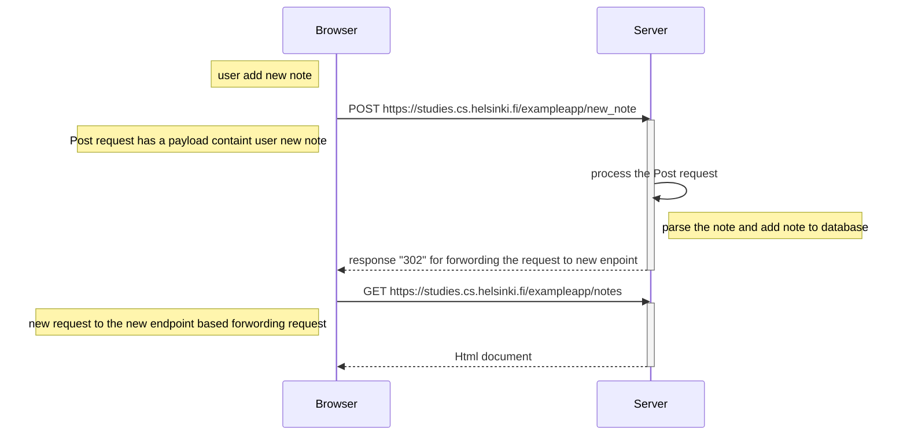

# Exercise 4

```mermaid
sequenceDiagram
	participant B as Browser
	participant S as Server
	
	Note left of B : user add  new note	
	B ->> S : POST https://studies.cs.helsinki.fi/exampleapp/new_note
	activate S
	Note left of B : Post request has a payload containt user new note 
	S ->> S : process the Post request
	Note right of S : parse the note and add note to database  
	S -->> B : response "302" for forwording the request to new enpoint 
	deactivate S
	B ->> S : GET https://studies.cs.helsinki.fi/exampleapp/notes
	activate S
	Note left of B : new request to the new endpoint based forwording request
	S -->> B : Html document	
	deactivate S	
```

