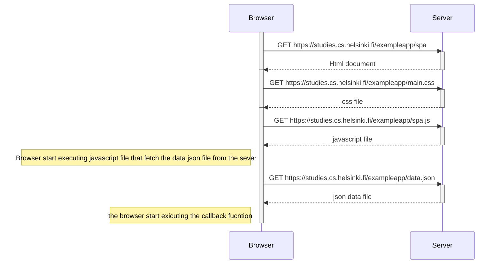

# Exercise 5

```mermaid 
sequenceDiagram
    participant B as Browser
    participant S as Server
    activate B
    B ->> S : GET https://studies.cs.helsinki.fi/exampleapp/spa

    activate S 
    S -->> B : Html document
    deactivate S
    deactivate B
    activate B
    B ->> S : GET  https://studies.cs.helsinki.fi/exampleapp/main.css
    activate S
    S -->> B : css file
    deactivate S
    deactivate B
    activate B

    B ->> S : GET  https://studies.cs.helsinki.fi/exampleapp/spa.js
    activate S
    S-->> B : javascript file
    deactivate S
    Note left of B: Browser start executing javascript file that fetch the data json file from the sever
    B ->> S : GET https://studies.cs.helsinki.fi/exampleapp/data.json
    activate S
    S -->> B : json data file
    deactivate S
    Note left of B : the browser start exicuting the callback fucntion
    deactivate B

```

