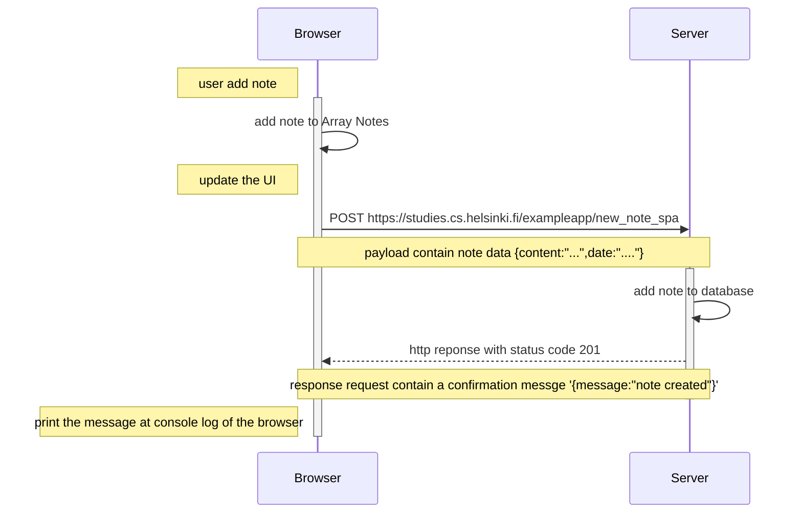

# Exercise 6

```mermaid

sequenceDiagram
	
	
	participant B as Browser
	participant S as Server 
	
	
	Note left of B : user add note 
	activate B
	B ->> B : add note to Array Notes
	Note left of B : update the UI
	B ->> S : POST https://studies.cs.helsinki.fi/exampleapp/new_note_spa
	Note over B,S : payload contain note data {content:"...",date:"...."}
	activate S
	S->> S : add note to database
	S-->> B : http reponse with status code 201 	
	Note over B,S : response request contain a confirmation messge '{message:"note created"}'
	deactivate S
	Note left of B : print the message at console log of the browser 
	deactivate B  
	
	
	
```
